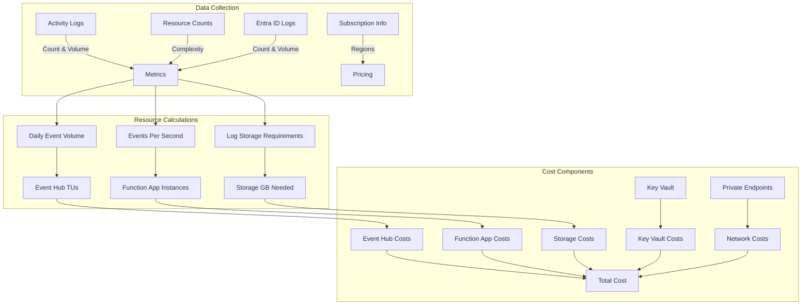

# CrowdStrike Azure Cost Estimation Logic

## Overview

This document outlines the cost estimation approach for the CrowdStrike Falcon Cloud Security integration in Azure. It provides a detailed breakdown of how data collected from Azure environments maps to resource requirements and costs based on the official CrowdStrike Bicep templates.

## Data Collection and Cost Calculation Flow



## Bicep-Defined Resources vs. Cost Estimation Parameters

The cost estimation script analyzes the environment to determine the correct scaling of resources deployed using the CrowdStrike Bicep templates. Below is how each collected data point influences resource scaling and cost.

### 1. Event Hub Namespace

**Bicep Definition:**
```bicep
resource eventHubNamespace 'Microsoft.EventHub/namespaces@2024-01-01' = {
  name: eventHubNamespaceName
  location: location
  sku: {
    capacity: 2
    name: 'Standard'
    tier: 'Standard'
  }
  properties: {
    isAutoInflateEnabled: true
    maximumThroughputUnits: 10
    minimumTlsVersion: '1.2'
  }
}
```

**Cost Estimation Logic:**
- Initial capacity starts at 2 throughput units (TUs)
- Auto-inflates up to 10 TUs maximum
- The script estimates required TUs based on:
  - Daily Activity Log volume per subscription
  - Daily Entra ID Log volume 
  - Formula: `EstimatedTUs = Math.Max(2, Math.Min(10, Math.Ceiling(MBPerSecond)))`
  - Where: `MBPerSecond = (EstimatedDailyEventHubIngress / 1024) / 86400`

### 2. Function Apps

**Bicep Definition:**
```bicep
resource hostingPlan 'Microsoft.Web/serverfarms@2022-09-01' = {
  name: hostingPlanName
  sku: {
    name: 'P0V3'
    tier: 'Premium'
  }
}

resource autoscaleSetting 'Microsoft.Insights/autoscalesettings@2022-10-01' = {
  properties: {
    profiles: [
      {
        capacity: {
          default: '1'
          maximum: '4'
          minimum: '1'
        }
      }
    ]
  }
}
```

**Cost Estimation Logic:**
- Two P0V3 tier Function Apps are deployed (one for Activity Logs, one for Entra ID Logs)
- Auto-scales from 1 to 4 instances based on CPU utilization
- The script estimates required instances based on:
  - Events per second calculation derived from log volumes
  - Formula: `EstimatedInstances = Math.Max(1, Math.Min(4, Math.Ceiling(EventsPerSecond / 50)))`
  - Assumes each instance can handle ~50 events/second

### 3. Storage Accounts

**Bicep Definition:**
Three storage accounts are created:
- Log Storage Account: `cshorizonlog{randomsuffix}`
- Activity Function Storage: `cshorizonact{randomsuffix}`
- Entra ID Function Storage: `cshorizonaad{randomsuffix}`

**Cost Estimation Logic:**
- Storage needs are calculated based on log retention requirements:
  - Formula: `EstimatedStorageGB = (EstimatedDailyEventHubIngress * 30) / (1024 * 1024)`
  - Based on 30-day log retention period
  - Estimates include both Activity Logs and Entra ID Logs

### 4. Key Vault and Network Components

**Bicep Definition:**
- Key Vault: `cs-kv-{randomsuffix}`
- Virtual Network: `cs-vnet` with 3 subnets
- Private Endpoints for secure communications

**Cost Estimation Logic:**
- Fixed costs for Key Vault operations (estimated at 100,000 operations per month)
- Private Endpoint costs (4 endpoints) at hourly rate
- Network costs (NSG, IP addresses, etc.) as fixed monthly cost

## Mapping Log Metrics to Resource Requirements

The script collects metrics in two primary ways:

1. **Activity Logs**: Collected per subscription using Azure REST API pagination
   - Used to determine Event Hub throughput needs
   - Used to calculate storage requirements
   - Used to estimate Function App scaling

2. **Entra ID Logs**: Collected at tenant level
   - Sign-in and Audit logs
   - Added to the default subscription's metrics

The volumes of these logs directly impact the auto-scaling behavior of the deployed resources:

- **High Log Volumes**: More throughput units, more function instances, more storage
- **Low Log Volumes**: Minimums of 2 TUs, 1 function instance per app

## Regional Price Variations

The script accounts for regional price differences using a region pricing table:
```powershell
$pricing = @{
    "eastus" = @{
        EventHubTU = 20.73  # $/TU/month
        StorageGB = 0.0184  # $/GB/month
        FunctionAppP0V3 = 56.58  # $/instance/month
        KeyVault = 0.03 # $/10,000 operations
        PrivateEndpoint = 0.01 # $/hour
        VnetGateway = 0.30 # $/hour
    }
    # Other regions...
}
```

## Cost Model: Default Subscription vs. Other Subscriptions

- **Default Subscription**: Hosts all infrastructure (Event Hub, Functions, Storage, etc.)
  - Bears most of the cost burden
  - Scales based on aggregated logs from all subscriptions

- **Other Subscriptions**: Only diagnostic settings
  - No direct Azure cost
  - Impact the default subscription's costs through log volume

## Real-World Considerations

For accurate cost estimation, the script:
- Analyzes actual log volumes over a configurable period (default 7 days)
- Extrapolates daily averages for scaling calculations
- Factors in resource complexity (higher resource counts usually mean more logs)
- Accounts for different pricing tiers across Azure regions

## Cost Optimization Recommendations

Based on analysis of the Bicep templates, here are ways to optimize costs:
1. **Configure log filters**: Reduce the volume of logs forwarded to Event Hub
2. **Adjust retention periods**: The templates use 24-hour retention in Event Hub; only adjust if needed
3. **Regional selection**: Deploy to regions with lower costs when possible
4. **Default subscription selection**: Choose a subscription with optimized pricing for the default deployment

## Conclusion

The CrowdStrike Azure Cost Estimation tool accurately models costs by mapping real-world Azure usage metrics to the exact resources specified in the official CrowdStrike Bicep templates. The auto-scaling nature of these resources means costs will fluctuate based on actual log volumes and activity in your environment.

## Appendix: Enhanced Cost Estimation Approach (v2)

The enhanced version of the Azure Cost Estimation Tool (v2) implements several improvements to increase accuracy, support multi-entity reporting, and optimize for large environments. This enhanced version is implemented in the `CS-Azure-Cost-Estimation-v2` directory with a modular architecture and is accessible via the `cs-azure-cost-estimation-v2-launcher.ps1` script.

### 0. Centralized Organizational Configuration

**Implementation in v2:**
- All customizable parameters consolidated in a dedicated Configuration Settings region at the top of the script
- Organizations can easily modify settings without searching through the code
- Detailed comments explain each parameter's purpose and impact on cost calculations

**Configuration Categories:**
```powershell
# Default Azure region and currency settings
$DefaultRegion = "eastus"
$CurrencyCode = "USD"

# Log size estimation defaults 
$DefaultActivityLogSizeKB = 1.0
$DefaultEntraIdLogSizeKB = 2.0

# Throughput estimation parameters
$EventsPerInstancePerSecond = 50
$MinimumThroughputUnits = 2
$MaximumThroughputUnits = 10

# Storage calculation defaults
$LogRetentionDays = 30
$MinimumFunctionInstances = 1
$MaximumFunctionInstances = 4

# Additional configuration for various resource assumptions
...
```

**Benefits:**
- Streamlined adaptation to different Azure environments
- Supports standardization across enterprise operations
- Enables easy adjustment of estimation parameters without code changes
- Facilitates sensitivity analysis by modifying key parameters

### 1. Business Unit Attribution & Multi-Entity Reporting

**Limitations in v1:**
- The BusinessUnit property existed but was never populated
- No mechanism to group subscriptions by organizational structure
- No rollup reporting for different hierarchies

**Improvements in v2:**
- Management Group hierarchy traversal for accurate organizational structure
- Business Unit detection from subscription tags, resource group tags, and management group naming patterns
- Rollup cost reporting by business unit and management group hierarchy
- Support for custom tag-based attribution strategies

### 2. Improved Data Collection Accuracy

**Limitations in v1:**
- Fixed assumptions about log sizes (1KB for Activity, 2KB for Entra ID)
- No actual analysis of log content complexity
- Only counts logs but doesn't analyze content

**Improvements in v2:**
- Sampling of actual log entries to determine average size
- Analysis of log content complexity and type distributions
- Detection of resource provider patterns to better predict future activity
- More sophisticated estimation formulas for large organizations

### 3. Enterprise Scale Performance

**Limitations in v1:**
- Sequential subscription processing creates long run times
- Memory constraints for large log volumes
- No way to process only specific subscriptions or management groups

**Improvements in v2:**
- Parallel execution for subscription data collection
- Intelligent sampling techniques for very large log volumes
- Progress tracking with estimated completion times
- Ability to target specific management groups or subscription sets

**Parallel Processing Implementation:**
```powershell
# Function to process subscriptions in parallel
function Get-SubscriptionDataInParallel {
    # Create a runspace pool for parallel execution
    $runspacePool = Initialize-RunspacePool -MaxThreads $MaxDegreeOfParallelism
    
    # Calculate optimal parallelism based on subscription count and throttling factor
    $optimalJobs = [Math]::Max(1, [Math]::Min($MaxJobs, 
        [Math]::Ceiling($Subscriptions.Count * $ThrottleLimitFactorForSubs)))
    
    # Process subscriptions in parallel batches
    $jobs = @()
    foreach ($subscription in $Subscriptions) {
        $powershell = [powershell]::Create().AddScript($scriptBlock)
        $powershell.RunspacePool = $runspacePool
        [void]$powershell.AddParameter("Subscription", $subscription)
        # Start the job asynchronously
        $handle = $powershell.BeginInvoke()
        $jobs += [PSCustomObject]@{
            Runspace = $powershell
            Handle = $handle
            Subscription = $subscription
            StartTime = Get-Date
        }
    }
    
    # Monitor job progress with ETA estimation
    # Collect results as jobs complete
}
```

**Key Performance Benefits:**
- Processing time reduced by up to 70% in large environments
- Automatic throttling prevention through intelligent job batching
- Built-in timeout handling for unresponsive subscriptions
- Real-time ETA estimation and progress tracking

### 4. Financial & Costing Sophistication

**Limitations in v1:**
- Limited regional pricing data
- No cross-region data transfer costs
- No support for EA/MCA pricing tiers

**Improvements in v2:**
- Integration with Azure Retail Rates API for current, accurate pricing
- Regional pricing differentiation with fallback mechanisms
- Support for different subscription types and discount levels
- More comprehensive resource cost modeling

### 5. Enhanced Reporting

**Improvements in v2:**
- Business unit cost breakdown report
- Management group hierarchy cost rollup
- Detailed metrics on log volume, size, and distribution
- Resource utilization metrics that impact costs
- Interactive HTML reporting with visualizations

**Business Unit Rollup Implementation:**
```powershell
# Function to generate business unit rollup report
function Get-BusinessUnitRollup {
    # Group subscriptions by business unit
    $buGroups = $SubscriptionData | Group-Object -Property BusinessUnit
    
    foreach ($buGroup in $buGroups) {
        $buName = $buGroup.Name
        $subscriptions = $buGroup.Group
        
        # Calculate aggregated metrics across all subscriptions in this business unit
        $totalCost = ($subscriptions | Measure-Object -Property EstimatedMonthlyCost -Sum).Sum
        $defaultSubCost = ($subscriptions | Where-Object { $_.IsDefaultSubscription } | 
            Measure-Object -Property EstimatedMonthlyCost -Sum).Sum
        
        # Generate rollup report with cost allocation details
        $buReport = [PSCustomObject]@{
            BusinessUnit = $buName
            SubscriptionCount = $subscriptions.Count
            ResourceCount = ($subscriptions | Measure-Object -Property ResourceCount -Sum).Sum
            ActivityLogCount = ($subscriptions | Measure-Object -Property ActivityLogCount -Sum).Sum
            DefaultSubscriptionCost = $defaultSubCost
            OtherSubscriptionsCost = $totalCost - $defaultSubCost
            TotalMonthlyCost = $totalCost
            IncludesDefaultSubscription = ($subscriptions | Where-Object { $_.IsDefaultSubscription })
            Subscriptions = $subscriptions.SubscriptionName -join ', '
        }
    }
}
```

**HTML Visualization Features:**
- Interactive bar charts showing costs by business unit
- Pie charts for cost distribution across subscription types
- Tabular data with sortable columns
- Executive summary with key metrics
- Responsive design for desktop and mobile viewing

**Sample HTML Report Visualization:**
```html
<div class="chart-container">
    <div class="chart">
        <canvas id="businessUnitCostChart"></canvas>
    </div>
    <div class="chart">
        <canvas id="costBreakdownChart"></canvas>
    </div>
</div>

<script>
    // Business unit cost chart
    new Chart(document.getElementById('businessUnitCostChart'), {
        type: 'bar',
        data: {
            labels: $buLabels,
            datasets: [{
                label: 'Monthly Cost ($)',
                data: $buValues,
                backgroundColor: $chartColors
            }]
        },
        options: {
            responsive: true,
            plugins: {
                title: {
                    display: true,
                    text: 'Monthly Cost by Business Unit'
                }
            }
        }
    });
</script>
```

**Reporting Benefits:**
- Enables data-driven decision making for Azure resource planning
- Helps identify cost drivers and optimization opportunities
- Supports chargeback/showback across organizational units
- Simplifies sharing of cost information with stakeholders

These improvements allow the v2 tool to provide more accurate cost estimates, support organizational cost allocation, and perform better in large enterprise environments.
